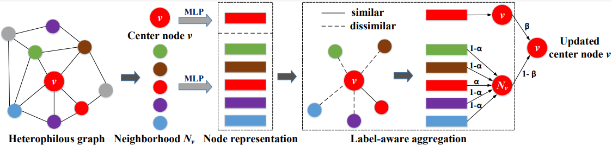

## LAAH: Label-aware Aggregation on Heterophilous Graphs for Node Representation Learning

This repository contains the code for our model, Label-aware Aggregation on Heterophilous Graphs for Node Representatin Learning.

## Description

Learning the node representation on heterophilous graphs has been an open and tricky issue owing to the fact that various nodes with dissimilar labels or attributes are connected in the graphs. The existing approaches boost the node classification accuracy by balancing the contributions between each center node and its neighborhoods. However, they treat all neighborhoods as equally important, which failed to explore the distinctive contributions of similar/dissimilar neighborhoods, especially their impact on heterophilous graphs under different homophily ratios. To address these issues, we propose label-aware aggregation on heterophilous graphs for node representation learning (termed LAAH), which is a simple yet effective architecture that only borrows the feature and label information of the 1-hop neighborhoods during the feature aggregation.

  

